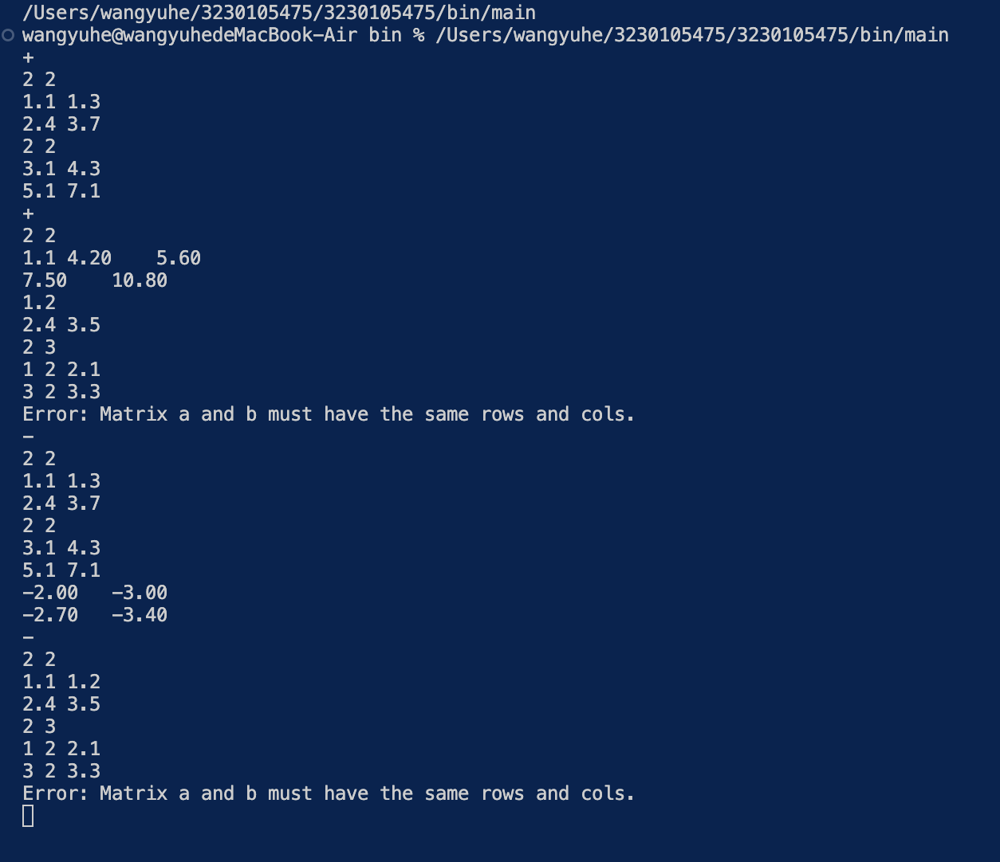

# Algebra Implementation

## 实现思路

### create_matrix
创建一个指定行数和列数的矩阵。

### add_matrix
将两个相同大小的矩阵相加，如果矩阵大小不同则返回错误信息。

### sub_matrix
将两个相同大小的矩阵相减，如果矩阵大小不同则返回错误信息。

### mul_matrix
将两个矩阵相乘，如果第一个矩阵的列数不等于第二个矩阵的行数则返回错误信息。

### scale_matrix
将矩阵的每个元素乘以一个常数。

### transpose_matrix
计算并返回矩阵的转置。

### det_matrix
计算并返回方阵的行列式，如果矩阵不是方阵则返回错误信息。

### inv_matrix
计算并返回方阵的逆矩阵，如果矩阵不是方阵或行列式为零则返回错误信息。

### rank_matrix
计算并返回矩阵的秩。

### trace_matrix
计算并返回方阵的迹，如果矩阵不是方阵则返回错误信息。

### print_matrix
按格式打印矩阵的内容。

## 本地运行截图

